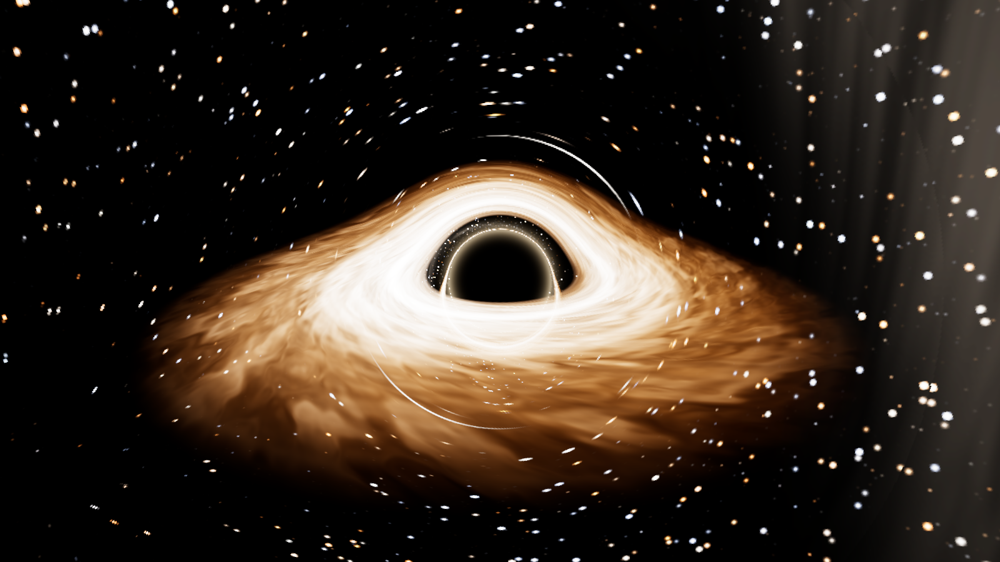

# quest-blackhole — Gargantua in WebXR

A gravitationally-lensed black hole with a relativistic accretion disk — the
*Interstellar* flyby — ray-traced live in the browser and built for the
**Meta Quest** (WebXR). Float in space, cruise past the disk, and watch the
universe warp around the shadow.



Everything you see is computed per-frame in a fragment shader: null geodesics
are integrated through the Schwarzschild metric, so the shadow, the photon
ring, the doubled over/under image of the disk's far side, and the
Einstein-ring warping of the background stars all emerge from the physics —
nothing is painted on.

## Try it

**In VR (Meta Quest):** open the GitHub Pages URL in the Quest Browser and
press **Enter VR**. Left stick flies, right stick turns/rises, **A** resumes
the cinematic tour, **B** toggles stats. Motion starts on a slow cruise; touch
the left stick any time to take over.

**On desktop:** same URL — drag to look, `WASDQE` to fly (`Shift` boosts,
wheel scales speed), `T` toggles the tour, `H` toggles stats.

Useful URL parameters: `?tier=0..4` (fixed quality), `?cine=0..1`
(0 = full relativistic Doppler beaming, 1 = the movie's muted look, default
0.65), `?pose=1..4` (canned viewpoints), `?tour=0`, `?clean` (hide UI).

## One-time repo setup

1. **Enable Pages:** Settings → Pages → Source: **GitHub Actions**. The
   `Deploy to GitHub Pages` workflow publishes `dist/` on every push to
   `main`.
2. **Fetch the real sky (recommended):** Actions → **Fetch NASA star map
   assets** → Run workflow. Runners download NASA's *Deep Star Maps 2020*
   HDR EXR (1.7 billion real stars, Gaia DR2), tone-map + downsample it, and
   commit an 8k KTX2 (GPU-compressed) primary and a 4k JPEG fallback. Until
   then the app renders a procedural star field so it works out of the box.

## How it stays fast on a headset

- The black hole and stars are at optical infinity, so **one mono cubemap
  centered on the head is stereo-correct**. The expensive lensing shader
  renders into that offscreen cubemap **round-robin (a few faces per frame)**
  while both eyes just sample it — head rotation costs nothing, and the eye
  buffers stay at full sharpness.
- Rays that pass far from the hole (impact parameter `b > 15 r_s`, beyond any
  possible disk intersection) take an analytic weak-field bend instead of the
  full march — only the central cone pays for geodesic integration.
- A quality manager watches frame times and steps face resolution, march step
  count, and refresh cadence up/down (5 tiers, auto by default).

## The physics

- Null geodesics in the Schwarzschild metric (`r_s = 1`, `G = c = 1`),
  integrated with a budgeted leapfrog on `a = -(3/2) h² x / r⁵` — the 3D form
  of the photon Binet equation `u'' = -u + (3/2) u²`.
- Thin-disk emission from ISCO (`3 r_s`) to `14 r_s`: Keplerian differential
  rotation shears procedural noise into filaments; temperature falls as
  `r^-3/4` through a blackbody ramp; Doppler factor `1/γ(1 - β·n̂)` and
  gravitational redshift `√(1 - r_s/r)` shift color and beam intensity
  (`δ³`). The *cinematic* slider mutes those shifts — the film's own
  documented choice (the DNGR paper, James et al. 2015).
- `npm test` runs physics self-tests: weak-field deflection vs the analytic
  series `2/b + (15π/16)/b²`, the photon-capture boundary vs
  `b_crit = (3√3/2) r_s ≈ 2.598`, and the budgeted integrator vs a fine-step
  RK4 reference.

## Development

```bash
npm install
npm run dev     # local dev server
npm test        # geodesic physics self-tests
npm run build   # production build to dist/
npm run shot    # headless screenshots of canned poses (needs Chromium)
```

## Credits & licenses

- Code: MIT (this repository).
- Star map: **NASA/Goddard Space Flight Center Scientific Visualization
  Studio. Gaia DR2: ESA/Gaia/DPAC** — [Deep Star Maps 2020](https://svs.gsfc.nasa.gov/4851).
- Lensing technique after [oseiskar/black-hole](https://github.com/oseiskar/black-hole)
  (MIT) and [ebruneton/black_hole_shader](https://github.com/ebruneton/black_hole_shader)
  (BSD-3-Clause).
- Physics reference: James, von Tunzelmann, Franklin & Thorne,
  *Gravitational lensing by spinning black holes in astrophysics, and in the
  movie Interstellar*, Class. Quantum Grav. 32 065001 (2015) —
  [arXiv:1502.03808](https://arxiv.org/abs/1502.03808). Look reference:
  [NASA's 2019 black hole visualization](https://svs.gsfc.nasa.gov/13326)
  (J. Schnittman).
